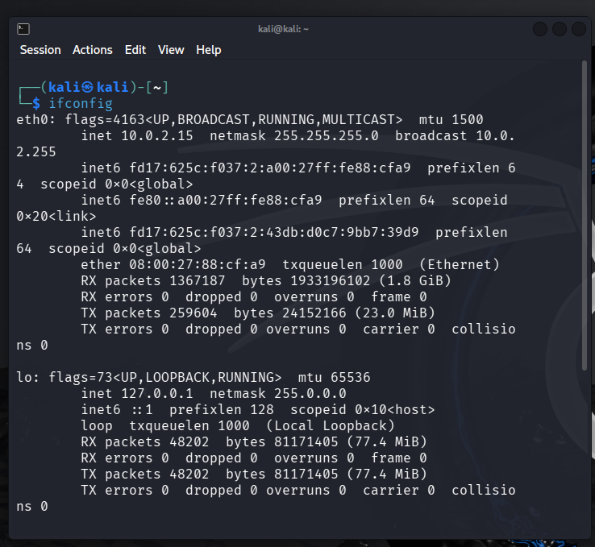
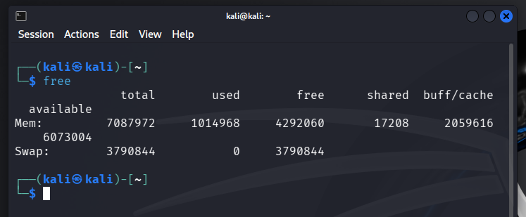
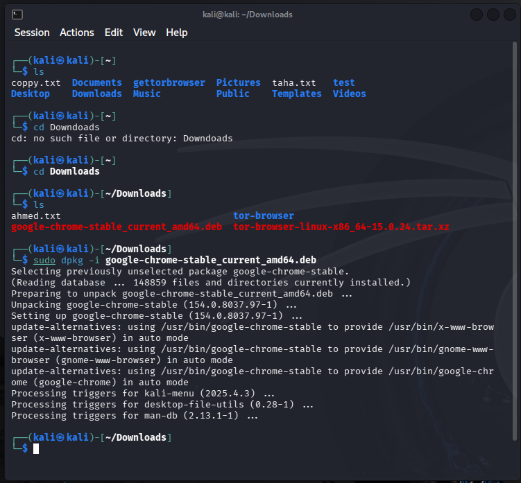

# Linux

- Linux  is Open Sorce Operating system that can be modified by you.

- Anyone can addn, remove code in linux.

- Linux is used for android mobiles as Operating system also

- More secure than Windwos

- More fast than Windows

- Provides all Haking tools For Free

## Ther are distribution for linux : 

- Debian (kali)

- Ubuntu

- Red Hat

- Fedora

- Centos ...

# Command Line

### After installing the system open treminal and update it by:

- `sudo apt update` 
- `sudo apt upgrade`
- apt is used to install new applications in linux

### update & upgrade

- `update` downloads the list of the newest software version.

- `upgrade` install the newer versions of the software on yor system.
```
sudo apt update

sudo apt upgrade
```

### sudo

- sudo means super user or (high privileges)

- (when you see (premission denised)) use :
```
sudo
```
### some command 

- To see the current user
```
whoami
```
- To see files on same directory or folder
```
ls
```
- To see the current folder 
```
pwd
```
- To move to folder 

```
cd
```
- To get back to previous folder

```
cd ..
```
- To read file called name.txt

```
cat name.txt
```
- then write then CTRL+X then Y 
```
nano name.txt
```

- To remove file called name.txt

```
rm name.txt
```
- To create new folder called tom

```
mkdir tom
```

- To remove the folder tom 

```
rm -r tom
rm -r /home/kali/name
```

- Ther are tow types of paths :

- absolute path starts with /
- Ex: /home/name/downloads/
- Relative path :
It is current path and you don't need to discribe the full path 

------------------------------

- copies files and folders.
```bash
cp file.txt backup.txt
cp file.txt /home/user/Documents/
```

--------------------------------

- `mv` moves files and folders from one place to another.

```bash
mv file.txt /home/user/Documents/
mv oldname.txt newname.txt
mv myfolder/ /home/user/Documents/
```

--------------------------------

### Defference between write and append
- To write is to add new content to file but deletes the old content
- To append is to add new content without deleting old content

```bash
echo "hello" > file.txt
echo "world" >> file.txt
cat file.txt
```
----------------------------

- To get informaton about network

```bash
ifconfig
```


-------------------------------------

- To get information about memory space

```bash
free
```

- To get information about hard disk

```bash
df -h
```
- To information about %CPU

```bash
ps aux
```

- To kill a process

```bash
kill PID
```

------------------------------------

- There are many ways to install applications in linux.

- First: use # `apt install <application>`
- Second: use # `snap install <application>`

- Third use # `dpkg -i <application.deb>`



----------------------------------

- Permissions for files are (read write execute ).

- Execute => 1 =>
x
- Write =>
2 => W
- Read => 4 =>
r
- If you need read & write then 4+2 = 6

- To change the permissions for a file xyz.txt 
```bash
chmod 777 xyz.txt
```
- To add execute permission to a file xyz.txt 
```bash
chmod +x xyz.txt
```
-------------------------------

- To redirect the output to another command use
|
- To get the word hossam from file called xyz.txt
```bash
 cat xyz.txt | grep "hossam"
```
- To know the number of lines in file xyz.txt
```bash
 cat xyz.txt | wc
 ```

 -----------------------------------


# find

- `find` searches for files and folders inside a given path.

- Syntax: `find <path> <options>`

## Basic search

```bash
find / -name "config.php"
find / -iname "config.php"      # ignore case
```

## By type

```bash
find / -type f -name "*.txt"    # files only
find / -type d -name "backup"   # folders only
```

## By permission (privilege escalation)

```bash
find / -perm -4000 2>/dev/null
```

## By owner

```bash
find / -user root
```

## By size

```bash
find / -size +100M      # bigger than 100MB
find / -size -10k       # smaller than 10KB
```

## By modified time

```bash
find / -mmin -10        # modified in the last 10 minutes
```

## Run a command on results

```bash
find / -name "*.log" -exec cat {} \;
```

## Combine conditions

```bash
find / -type f -size +100M -name "*.log" 2>/dev/null   # AND (default)
find / -type f \( -name "*.txt" -o -name "*.log" \)      # OR
find / -type f ! -name "*.log"                           # NOT
```

## Save results

```bash
find / -name "*.conf" > results.txt       # write
find / -name "*.log" >> results.txt       # append
find / -name "*.conf" | tee results.txt   # save + show on screen
```

---

**Always add `2>/dev/null` when searching from `/`** to hide "Permission denied" errors.

---------------------------------------------

### zip / unzip

#### Create a zip

```bash
zip file.zip file1.txt file2.txt     # zip specific files
zip -r folder.zip folder/            # zip a folder (-r = recursive)
```

#### Extract a zip

```bash
unzip file.zip                       # extract in current directory
unzip file.zip -d /path/to/folder    # extract into a specific folder
```

#### View / Test

```bash
unzip -l file.zip                    # list contents without extracting
unzip -t file.zip                    # test the archive for errors
```

#### Useful Flags

```bash
zip -e file.zip file.txt             # encrypt with a password
zip -r -9 folder.zip folder/         # max compression (-1 fastest, -9 best)
zip -r folder.zip folder/ -x "*.log" # exclude files
```

- `-r` : recursive (required for folders)
- `-d` : destination directory (unzip)
- `-l` : list contents
- `-e` : encrypt with a password

#### Install (if missing)

```bash
sudo apt install zip unzip
```

---------------------------------------------